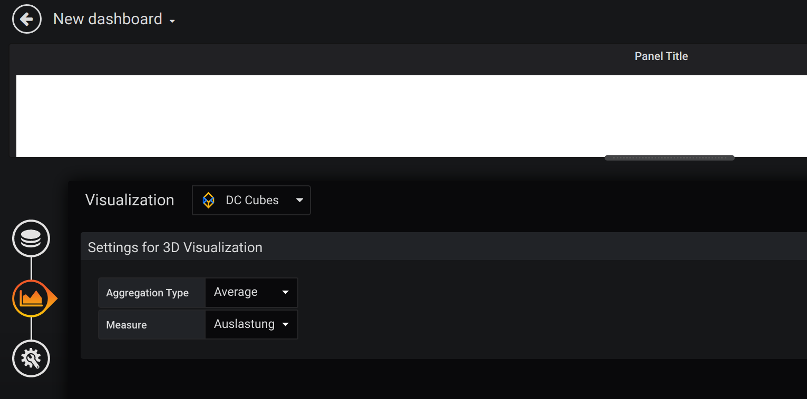

# DC Cubes

## What is DC Cubes?

DC Cubes is an web application based on React and TypeScript with the objective to visualize large amount of infrastructure data (such as the average response time of servers).

## Visualization 

DC Cubes uses 3D to visualize the infrastructure data and relies on a
city visualization metaphor.
A district in the city is a cluster, a house represents a server, the height of a house is the altitude of a metric of the server.

Due to the compact form of visualization and the different possible viewing angles of the 3D visualization, correlations can be better recognized.

## How about a look into the future?

Currently, a machine learning feature is under development, which provides an insight into future expectable infrastructure data.
With DC Cubes it will not only be possible to get a compact overview of current data, but also an outlook on future data. This allows a more comprehensive and future-oriented evaluation of the data.

## Grafana Plugin available
- [Installation and development guide (EN)](docs/en/instructions_grafana_plugin.md) 

## Technology Stack Overview & Data Architecture

## High-level view of software architecture

## Ready for a demo?
Get your hands on with our easy to use Docker start sript:

- [Setup DC Cubes with Docker-Desktop (EN)](docs/en/local_docker_cubes_setup.md) 
- [Anleitung: DC Cubes mit Docker-Desktop (DE)](docs/de/cubes_lokal_mit_docker-desktop.md)

### w/o docker (in particular for the development)
- *EN guide coming soon* 
- [Anleitung: DC Cubes und Solr lokal aufsetzen (DE)](docs/de/cubes_solr_lokal_aufsetzen.md)

