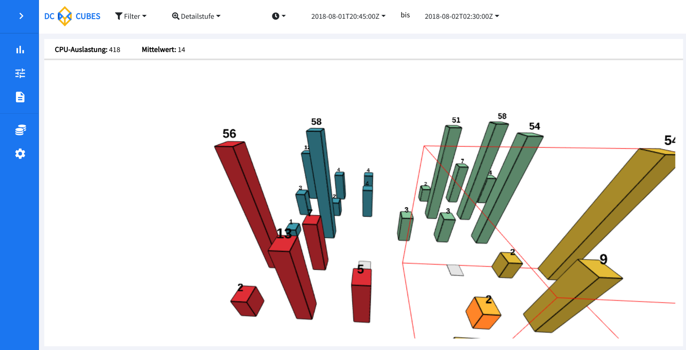
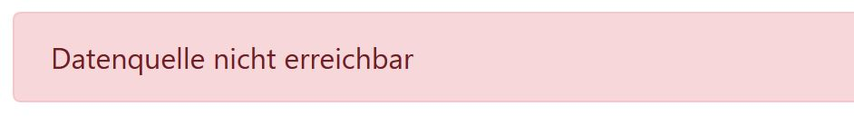

# DC-Cubes per Docker starten



Diese Anleitung hilft beim lokalen Ausführen von DC_Cubes.

## 1. Voraussetzungen

1. [Windows 10](https://hub.docker.com/editions/community/docker-ce-desktop-windows) mit installiertem [Docker-Desktop](https://hub.docker.com/editions/community/docker-ce-desktop-windows)
oder [Linux](https://docs.docker.com/install/linux/docker-ce/ubuntu/) / [Mac OS](https://docs.docker.com/docker-for-mac/install/) mit aktueller Docker Version.
2. Lokale Version des [Repositorys](https://github.com/Sultanow/dc_cubes) per Git klonen. Alternativ kann auch das Repo als Zip heruntergeladen und entpackt werden.

## 2. Bauen und Starten von DC-Cubes
Starten der Powershell (Windowstaste > Suchen nach "Windows PowerShell" > starten) oder dem Terminal.
Zum Repository wechseln:

Windows:
```
cd C:\**PFAD_ZUM_REPO**\dc_cubes
```

Linux / Mac OS:
```
cd /home/**BENUTZER**/**PFAD_ZUM_REPO**/dc_cubes
```

Aus dem **Hauptverzeichnis** des lokal vorliegenden Repos folgenden Befehl ausführen:

Windows:
```
 .\docker\buildAndRun.ps1
 ```

Linux / Mac OS:
```
./docker/buildAndRun.sh
 ```

Anschließend wird DC-Cubes für gebaut, die notwendigen Docker-Container werden hochgefahren und der Import von Beispieldaten wird gestartet.
Wenn das Script durchgelaufen ist (Laufzeit ca. 8-10 min), dann öffnet sich der Standardbrowser mit der Adresse zu DC-Cubes.

## 3. Ändern der Datenquelle (Temporärer notwendiger Schritt):

Zunächst erscheint folgende Fehlermeldung:



Da die Adresse zur Datenquelle (Apache Solr) von der Entwicklungsinstanz abweicht, muss derzeit die Datenquelle in DC-Cubes händisch angepasst werden. Dieser Schritt fällt demnächst weg - eine Lösung hierfür befindet sich aktuell in Entwicklung.

Die Datenquelle kann über diesen Punkt "Einstellung Datenquelle" (Icon in der Sidebar): 


angepasst werden. 

Folgende Einstellungen sind vorzunehmen:


Wichtig ist hier die Anpassung der URL von ```http://localhost:8983/solr/``` auf ```http://localhost/solr/```


## Stoppen und Starten ohne Import der Beispieldaten
DC Cubes kann mit den zugehörigen Skripten auch ganze einfacher gestoppt und gestartet werden.
Hierzu einfach folgenden Befehl aus dem Hauptverzeichnis ausführen:

Windows:
``` .\docker\run.ps1 ``` oder ``` .\docker\stop.ps1 ```

Linux:
``` ./docker/run.sh ``` oder ``` ./docker/stop.sh ```

----

## Problembehandlung

### Datenquelle nicht erreichbar

Bitte überprüfen ob Schritt 3. durchgeführt wurde. 
Zusätzlich kann mithilfe des Befehls ```docker ps ``` nachgesehen werden, ob die Container auch laufen:


Sicherstellen, dass hier bei Container (NAMES): dc_cubes und dc_cubes_solr gelistet sind und der Status jeweils "Up" entspricht. 

Bei Fehlern bitte mit ```docker logs dc_cubes``` bzw. ```docker logs dc_cubes_solr``` die Logs anschauen und ggf. die Ausgabe an die Entwickler weiterleiten.

> In jedem Fall kann das Skript auch einfach nochmals gestartet werden. Hierzu wieder bei Schritt 1 beginnen.

### Keine Daten sichtbar?

Wurde die Seite neugeladen? - Dann muss die Datenquelle aktuell leider erneut angepasst werden.
Eine Speicherung der Einstellung ist derzeit in Entwicklung.


