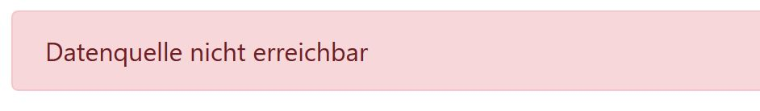
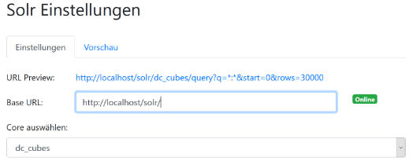
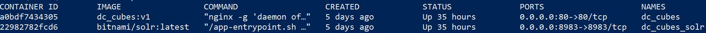

# Local dc_cubes docker setup


This guide shows how to run dc_cubes locally.

## 1. Prerequisites

1. Windows 10 with [Docker-Desktop](https://hub.docker.com/editions/community/docker-ce-desktop-windows) installed OR current version of docker for [Linux](https://docs.docker.com/install/linux/docker-ce/ubuntu/) / [Mac OS](https://docs.docker.com/docker-for-mac/install/) 

2. Cloned local copy of this [repository](https://github.com/Sultanow/dc_cubes) (or extracted zip)

## 2. Building and starting dc_cubes
Start a powershell terminal (Windows > Search for "Windows Powershell" > Enter) or a terminal session if you use Linux / Mac OS.

Change directory to the repository:

Windows:
```
cd C:\**PATH_TO_REPO**\dc_cubes
```

Linux / Mac OS:
```
cd /home/**USER**/**PATH_TO_REPO**/dc_cubes
```

Execute the following command from the repositorys root folder:

Windows:
```
 .\docker\buildAndRun.ps1
 ```

Linux / Mac OS:
```
./docker/buildAndRun.sh
 ```

The script starts the production build process of dc_cubes and launches the required docker containers.
A solr importer is started as temporary docker container importing demo infrastructure data. In total this script needs about 8-10 min.
After the script finished your default browser will launch opening the right adress for using dc_cubes.

## 3. Change the data source (Temporary necessary step):

At first the following error message appears:



Currently the address to the containerized data source (Apache Solr) differs from the development instance. Therefore the data source in dc_cubes has to be adapted manually. This step will soon be omitted - a solution for this is currently under development.

The data source can be changed via the menu item "Setting data source" (icon in the sidebar): 


Please adjust the Solr-URL as shown in the screenshot:



Instead of ```http://localhost:8983/solr/``` it has to be ```http://localhost/solr/```.

## Start and stop dc_cubes w/o import of sample data
You can start and stop dc_cubes with the provided scripts:

Windows:
``` .\docker\run.ps1 ``` or ``` .\docker\stop.ps1 ```

Linux:
``` ./docker/run.sh ``` or ``` ./docker/stop.sh ```

> If you run (run script) dc_cubes after stopping (stop script) it, please redo step 3. 

----

## Troubleshooting

### Data source not reachable

Please check if step 3. was fulfilled. 
You can also use the ````docker ps ``` command to see if the containers are running:


Make sure that the containers (NAMES): dc_cubes and dc_cubes_solr are listed here and that their status corresponds to "Up". 

In case of errors, please use ```docker logs dc_cubes``` and ```docker logs dc_cubes_solr``` to view the logs and forward the output to the developers.

> It is also possible to run the script again.
All containers are then removed and recreated

### No data visible?

Did you reload the application? - Then the data source has to be updated again (Step 3).
Storing the users settings is currently under development.

Please also check if the time selection [from - to] is correct. Only data for the year 2018 are available.


