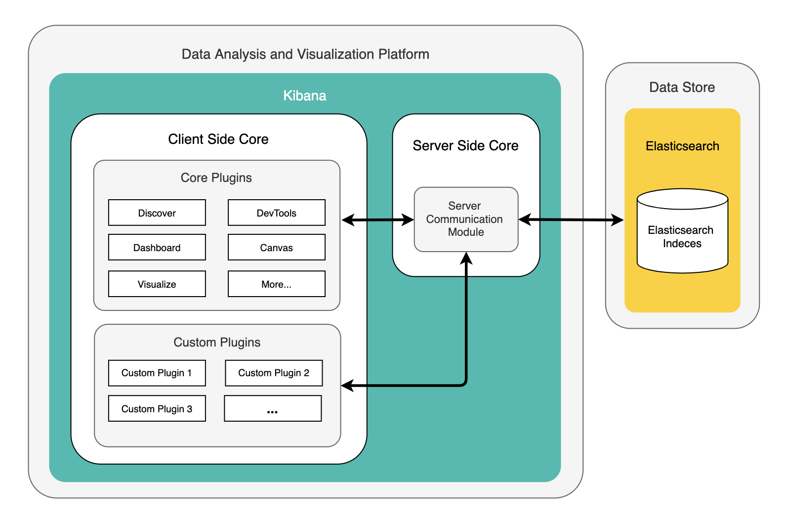
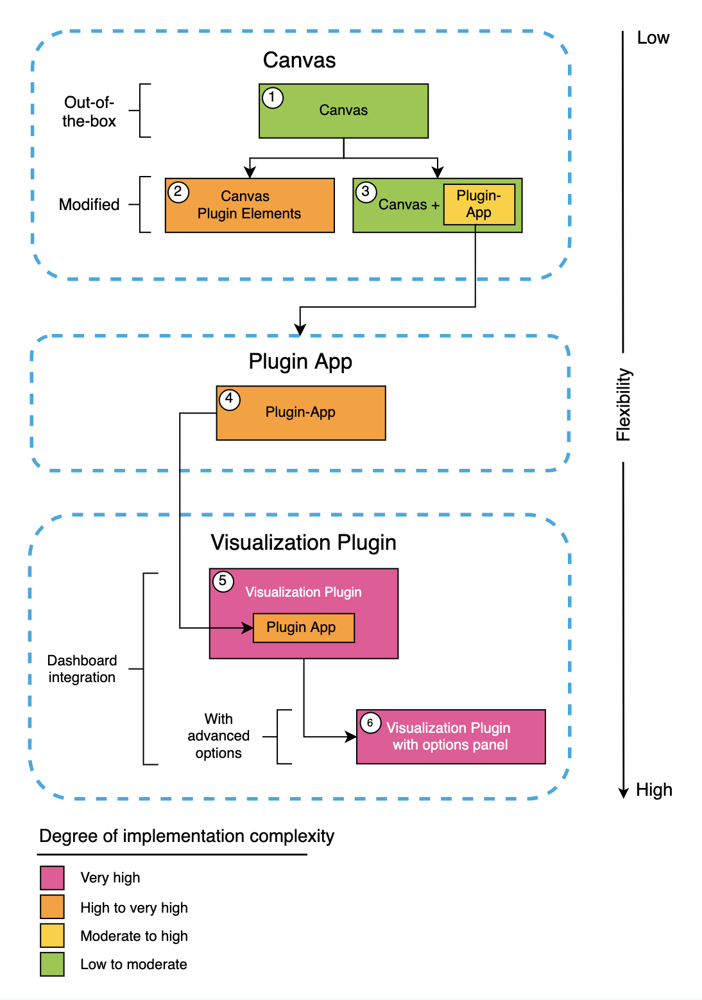
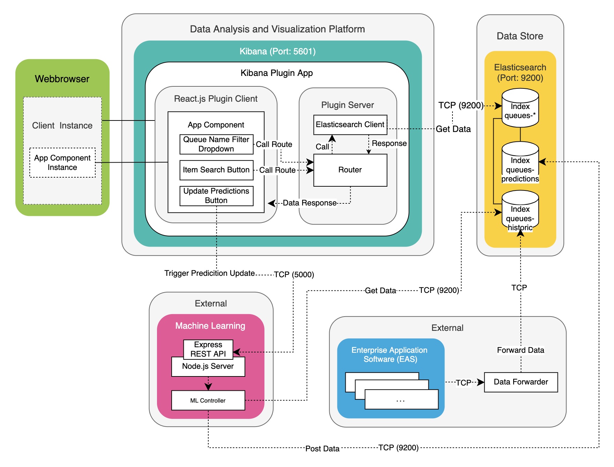

# Kibana Plugins

## What is Kibana?

Kibana is an open source analysis and visualization platform. (Works with Elasticsearch as a data storage). It can be used to search, view and interact with any structured or unstructured data stored in Elasticsearch. It enables seamless advanced data analysis and enables visualization of data in a variety of histograms, charts, graphs, tables and maps. Elasticsearch acts as a database for Kibana's data maintenance. 

### Kibana high-level dependancy diagram



## Kibana Plugins

User-defined customizations in Kibana can be implemented in different ways. After intensive research on extension possibilities in Kibana, the following options can be considered. The integration of the relevant user-specific modifications differ in the complexity of the implementation and the functional flexibility. The easiest way to implement individual customizations is to use the (1) Kibana Canvas plugin. This plugin is already pre-installed in the delivery state of Kibana. The disadvantage of this integration approach of extended functionality is the low flexibility. Only a limited number of functional elements can be integrated into the Canvas Workpad. These canvas elements have the disadvantage that they are not interactive and data queries are only possible in a limited complexity. The flexibility of the Kibana Canvas can be extended by more complex extensions. On the one hand, the functional flexibility can be increased by developing integrable (2) Canvas elements as plugins. On the other hand, the degree of functional flexibility can be increased by using one (3) Kibana plugin used in parallel to the canvas. Thereby functionalities which are not convertible with standard tools of the Kibana Canvas are shifted into a separate Plugin module. Additional functionalities can be integrated e.g. by interactive elements such as buttons or input fields. Apart from minor functional enhancements, program enhancements can also be made exclusively with the help of one (4) Kibana plugin. If you want to use the Kibana plugin integrated in a dashboard, you can do so by using a (5) Kibana Visualization plugin, which initially only performs a simple integration. Advanced options can be used to customize the visualization plugin integrated into the dashboard. For this purpose, the integration must also be adapted programmatically.



### Kibana Canvas Plugin

Because the implementation of the Plugin in the required range of functions via out-of-the-box Kibana tools is not possible, we examine the extension options of a Kibana Canvas. The selection of functional elements in the Workpad can be theoretically extended. Bringing a custom element or function into Canvas starts like any other custom code in Kibana, a plugin. There are a few dependencies that the plugin needs. The most important one is the interpreter that Kibana and Canvas use to register and evaluate expressions of the so-called Kibana expression language. Any modifications can be written to the plugin. Note that the elements and functions must be registered to make them available in Kibana.
Custom Kibana Canvas plugin element plugins can be implemented programmatically in Kibana in the latest version (version 7.8.1), but there is no official documentation for this approach and incompatible changes are expected in future versions. Elastic has not yet decided on a final architecture when developing this feature and therefore incompatible changes are to be expected, which could lead to the risk of large maintenance efforts during updates and thus violate the non-functional requirement of maintainability.

### Kibana Plugin App

The integration approaches described above could not meet the requirements. User-defined integration of a visualization solution has to be done programmatically in view of the fact that a solution with only standard tools is not realizable at the given time. For this the approach over the development of a Kibana Plugins is suitable. There are several options to develop custom plugins for Kibana. One option is to develop a Kibana Plugin App. In the following we would like to present an architecture for the integration of the visualization solution via the approach as Kibana Plugin App. At the beginning a short overview of the functionality of the system will be given. First of all, the plugin architecture and the data flow within the system within the Kibana platform and with external systems involved will be presented.

First, a basic plugin framework was generated with the Javascript Runtime Node.js as follows: ```node /scripts/generate_plugin.js```. This program is provided by the Kibana development environment. Below you can find the automatically generated plugin in the ```/Plugins``` directory in the Kibana project directory. The client code is in the /public directory and the backend in ```/server```. The generation of the plugin can be rated as easy. The following dependencies should be considered when developing a Kibana Plugin App. The plugin development requires technological dependencies. Besides the Javascript Runtime Node.js, a frontend technology is required for the development of the UI, because Kibana Apps are implemented as SPA. For the UI development the Javascript library React.js is supported.

We have already implemented the frontend as React application before. Therefore the system now only needed to be integrated into the Kibana platform. React components could be adopted so that they can be displayed in the Kibana app. The components: search box, drop down and buttons have been replaced by the corresponding [Elastic UI](https://elastic.github.io/eui/#/) component. Elastic UI is a design library used by Elastic to implement internal products. They correspond to the specifications of Elastic. EUI can also be used in the development of Kibana plugins. To aesthetically match the plugin to the Kibana platform, EUI was used in the plugin.



The queries are stored in the ```routes``` directory of a Kibana plugin and defined in ```index.ts```. 

```Typescript
const { Client } = require(’@elastic/elasticsearch’)
const client = new Client({ node: ’http://localhost:9200’)

// promise API
const result = await client.search({
    index: ’my-index’, 
    body: {
        query: {
            match: { hello: ’world’ }
        }   
    }
})
// callback API 
client.search({
    index: ’my-index’, 
        body: {
            query: {
                match: { hello: ’world’ }
            } 
        }
}, (err, result) => {
    if (err) console.log(err)
})
```

Here we see a route example for data query to the desired Elasticsearch Index. The route is called from the frontend via a HTTP request:

```Typescript
router.post({
    path: ’/api/item’, 
    validate: {
        body: schema.object({ item: schema.string(), name: schema.string(), tier: schema.string()}), 
    }
},
async (context, request, response) => {
const data = await client.search({ 
    index: ’queues’,
    body: {
        "_source": ["timestamp", "name", "size", "tier"], 
        "query": {
            "bool": {
                "must": [
                    { "match": { "items": request.body.item }},
                    { "match": { "tier": request.body.tier }},
                    { "match": { "name": request.body.name }} 
                ]
            } 
        },
        "aggs": { 
            "queue_enter" : {
                "top_hits": {
                    "size": 1,
                    "sort": [ { "timestamp": { "order": "asc" } } ],
                    "_source": { "includes": [ "timestamp", "name", "size", "tier" ] }
                }
            }, 
            "queue_left" : { 
                "top_hits": { 
                    "size": 1,
                    "sort": [ { "timestamp": { "order": "desc" } } ],
                    "_source": { "includes": [ "timestamp", "name", "size", "tier" ] }
                } 
            }
        } 
    },
    "size": 0 
    });
    return response.ok({ body: { data: data }, }); });
```

A POST request with query parameters sent to the router in the plugin server. The router sends a request to the internal Elasticsearch API, which communicates with Elasticsearch. 

A realization of the update function of forecast data was sent in this integration approach via a request request to an API server. This triggers the start of a Python application, which updates the predictions by machine learning and sends them to the target database. Machine learning models and ML management are not part of this thesis. Only infrastructural approaches in the context of ML processes were tested via the presented Proof of Concept (POC). 

The Kibana plugin has the highest degree of flexibility in implementing features. Especially noteworthy is the support of the powerful query DSL, which allows us to define very complex data queries that can be processed by the plugin. Furthermore, in contrast to preliminary integration iteration, we were able to use interactive GUI elements such as buttons, search fields, drop-down filtering, etc. in the plugin. 

However, the Kibana plugin integration approach should also be viewed critically. Due to the high degree of implementation complexity, the development of custom software according to customer needs can have a significantly higher additional development and customization effort than for institutions. When integrating into host infrastructures, it is important to consider how much modification of the standard program codes is acceptable, so that updateability is still guaranteed.  
In addition, when using the Kibana plugin, it must be noted that the Kibana plugin interfaces are in constant development. Due to the high rate of change, no guarantee can be given for backwards compatibility of Kibana. Kibana forces the installed plugins to be compatible with the voice. Plugin developers must therefore release a new version of their plugin for each new Kibana release.

## Design Decision for Implementing a Plug-In

| Approach      | Description  | Pros         | Cons  |
|:------------- |:-------------|:-------------| :-----|
| Use **Kibana Canvas** | Ready-made elements are puzzled together. Key numbers are placed in a (info)graphic and backed by queries (ESSQL, Canvas expression language, or Lucene) | Minimal effort, high maintainability | Little flexibility in querying, no complex queries possible. |
| **Kibana App with Standard Canvas:** Develop Kibana Plug-In, Use Kibana's Canvas without extending it (use standard visualization elements) | Develop separate elements using React-based Kibana Plug-In API, use these by the standard Canvas | Moderate effort, moderate maintainability | Flexibility is limited, Canvas cannot be extended by custome code, Low usability|
| **Custom Kibana Canvas:** Develop Kibana Canvas Plug-In | Extend Canvas Elements by own code using React | Medium flexibility in visualization. | Medium flexibility in querying. High effort, risk of high maintainability depending on your own code structure |
| **Kibana Visualization Plugin App:** Develop Kibana Plug-In without using Kibana Canvas or other Standard Components | Build a Kibana PLug-In by implementing the component for interactive visualization without using standard components | High effort, less maintainability which depends on size and structure of your own code | Very flexible |
| Develop **Kibana Visualization Plugin**. | Develop Kibana Visualization Plugin as embedded visualization | High reusability in Kibana: Use visualizations by multiple Dashboards in a simple way. | Hight Effort. Less Flexibility |


### Use Kibana Canvas
This approach is used for an Infographics that shows basic key numbers such as **queue size** and prospectively **queue throughput** for different queues.
One significant disadvantage is that queries for calculating those key numbers are limited. For example, we cannot calculate the **queue throughput** at this moment using the given data model. Calculating the throughput requires us to calculate the intersection (cut set) between two sets of queued items. We have an index called "queues" that stores snapshots of queue states as follows:
Each document contains (along some other fields) the following fields:

* **timestamp**: type=date, and it is searchable, aggregatable
* **items**: type=string, and it is searchable

The field items contains a large string consisting thousands of unsorted IDs, for example **items**="2070213614 2909589973 2771050342 ..."


We need to query two rows (for two given timestamps) and calculate the intersection (cut set) of both item lists. Ultimately we need to know the size of this cut set. It is difficult to deal with this problem, if we want to display the calculated size of this intersection in an Infographics Canvas in Kibana. The queries we are able to use are [ESSQL](https://www.elastic.co/de/blog/an-introduction-to-elasticsearch-sql-with-practical-examples-part-1), Lucene, or the [Canvas expression language](https://www.elastic.co/guide/en/kibana/current/canvas-function-reference.html) that supports [TinyMath functions](https://www.elastic.co/guide/en/kibana/current/canvas-tinymath-functions.html). Array functions such as [ARRAY_INTERSECT](https://docs.couchbase.com/server/current/n1ql/n1ql-language-reference/arrayfun.html#fn-array-intersect), which are available in Couchbase, are not provided in Elasticsearch. 

### Conclusion
We use Kibana Canvas for an Infographics that shows the state of all queues at a glance. At this moment it is a rough overview displaying the size of each queue. As the features of Kibana and Elasticsearch increase, especially as the query language becomes more powerful including functionalities of [Arrays](https://www.elastic.co/guide/en/elasticsearch/reference/current/array.html), we will further elaborate on the infographic. Then we also show the throughput with these on-board resources.

### Develop Kibana Plug-In, Use Kibana Canvas
This is a compromise between flexibility and implementation plus maintainance effort. Using [Kibana Plug-Ins](https://www.elastic.co/guide/en/kibana/current/kibana-plugins.html) we are more close to standard components, but must maintain code snippets for separate components that integrate into each other by the Kibana workflow. For example a button that trigger some individual action or setting is placed into Kibana's static UI structure. 

### Conclusion

Since the functionality of displaying the queue status and an item's history is not so extensive, we must not scatter code over many components. Rather, we can integrate this in a minimalist way in one component. Therefore we want to avoid this approach and try to build everything compactly into one component by the next approach *Developing Kibana Canvas Plug-In*. Note that the current Plug-In API is beeing replaced by a new concept. As of the official site [Introducing a new architecture for Kibana](https://www.elastic.co/de/blog/introducing-a-new-architecture-for-kibana) the makers of Elastic will be disabling the legacy plugin API in 7.11

### Develop Kibana Canvas Plug-In
This is a flexible way of developing a fully interactive canvas that is able to use queries which are complex as needed. The query results even can be postprocessed by custom functional code. Buttons and drop downs might be integrated into such an canvas without restriction. It should be noted that this API still is in development an to be considered as "Beta", see this [Link](https://discuss.elastic.co/t/custom-kibana-canvas-elements/202632/2) for more details.

### Conclusion
As long as we focus delimited and targeted functionality on one visualization component, this approach is appropriate. If the Canvas Plug-In API leafes its beta status and becomes future-proof, we would choose this approach to depict the overall status of the queues. An interactive search allows us to display the history and currnt location of a specific item.

### Develop Kibana Plug-In without using Kibana Canvas or other Standard Components
This is the most flexible way of developing the Plug-In, since we take advantage of the fact that we are not limited to use standard components. We develop the complete visualization and interaction part by our own. But at least the access to the Elasticsearch data sources is standardized. Exactly this standard we use for querying and retrieving the data.

### Conclusion
Being focussed on dedicated functionality in visualizating the queue status, this approach is the most appropriate. We follow this approach in the first step and we can migrate the implemented functionality later into an more standardized solution, if the standard components or the Kibana Canvas API become more powerful.

# build plugin distributable for production use

The plugins `poc_eldar` and `queues_plugin_full_integrated` have already been developed for the [new plugin architecture](https://www.elastic.co/blog/introducing-a-new-architecture-for-kibana). In order to build production plugins they need to be packaged (see [doc](https://www.elastic.co/guide/en/kibana/7.10/plugin-tooling.html#_build_plugin_distributable)). The packaging scripts in kibana 7.8 and 7.9 were in a transition phase towards the new plugin architecture and broken. The [old way of packaging](https://github.com/elastic/kibana/tree/7.9/packages/kbn-plugin-helpers) did no longer work, while the [new one](https://github.com/elastic/kibana/tree/7.10/packages/kbn-plugin-helpers) not yet in place (see [#71762](https://github.com/elastic/kibana/issues/71762), [#74604](https://github.com/elastic/kibana/pull/74604), [#75019](https://github.com/elastic/kibana/pull/75019), [#71762](https://github.com/elastic/kibana/issues/71762), [#70412](https://github.com/elastic/kibana/issues/70412), [#70426](https://github.com/elastic/kibana/issues/70426), [#63069](https://github.com/elastic/kibana/issues/63069)).

Make sure to have at least kibana 7.10 if not yet checked out and configured:
```
git checkout 7.10
# install nvm
https://github.com/nvm-sh/nvm
curl -o- https://raw.githubusercontent.com/nvm-sh/nvm/v0.35.3/install.sh | bash

# reopen terminal to get updated environment variables
# for kibana 4.9.1 the following node version is required
nvm install 10.23.1

Now using node v10.23.1 (npm v6.14.6)
Creating default alias: default -> 10.23.1 (-> v10.23.1)

# install yarn
# https://classic.yarnpkg.com/en/docs/install/#centos-stable
curl --silent --location https://dl.yarnpkg.com/rpm/yarn.repo | sudo tee /etc/yum.repos.d/yarn.repo
sudo yum install yarn

yarn policies set-version 1.22.4
```

Then building the distributable is possible
```
cd kibana/plugins/queues_plugin_full_integrated
yarn kbn bootstrap
yarn build
```

will result in
```
yarn run v1.22.5
$ yarn plugin-helpers build
$ node ../../scripts/plugin_helpers build
 info deleting the build and target directories
 info running @kbn/optimizer
 │ info initialized, 0 bundles cached
 │ info starting worker [1 bundle]
 │ succ 1 bundles compiled successfully after 20.6 sec
 info copying source into the build and converting with babel
 info running yarn to install dependencies
 info compressing plugin into [queuesPlugin-7.10.2.zip]
Done in 30.80s.
```

Install:
```
sudo /usr/share/kibana/bin/kibana-plugin --allow-root install file:///coremedia/home/picroot/queue/plugins/queuesPlugin-7.10.2.zip
```
[https://www.elastic.co/guide/en/kibana/7.10/kibana-plugins.html#install-plugin]

and restart kibana:
```
sudo systemctl restart kibana
```

## hints
```
# in case yarn throws git errors
mkdir -p "./--git-common-dir/hooks/ 

# in case node runs out of memory
export NODE_OPTIONS="--max_old_space_size=2048"
https://www.elastic.co/guide/en/kibana/master/development-getting-started.html

# packaging entire kibana should not be necessary
# however if it is required skip os packages, since they currenty require
# plattform specific code to be deployed and will fail otherwise
yarn build --skip-os-packages
```