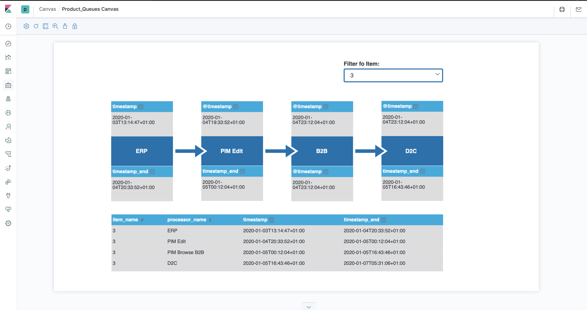
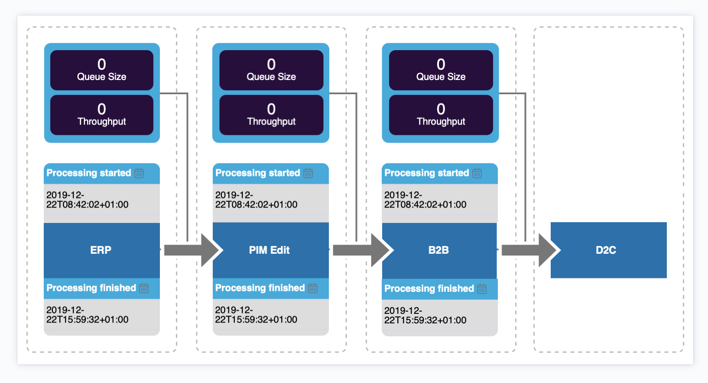

# Kibana Canvas

## What is Kibana Canvas?

Canvas is a data visualization and presentation tool that sits within Kibana. With Canvas, you can pull live data directly from Elasticsearch, and combine the data with colors, images, text to create dynamic, multi-page displays.

## How to use Kibana Canvas?

- Install Elasticsearch (v7.8)
- Install Kibana (v7.8)
- Setup Queues Prediction Plugin (v7.8)

## Install & run Elasticsearch with .zip on Windows

### Download & Install the .zip package

Download th .zip archive for Elasticsearch v7.7.0 from: <a href="https://artifacts.elastic.co/downloads/elasticsearch/elasticsearch-7.7.0-windows-x86_64.zip">elasticsearch-7.7.0-windows-x86_64.zip</a>

Unzip it with your favourite unzip tool. This will create a folder called elasticsearch-7.7.0, which we will refer to as %ES_HOME%

### Running Elasticsearch from the command line

Elasticsearch can be started from the command line as follows:

```
.\bin\elasticsearch.bat
```

## Install Elasticsearch on macOS with Homebrew

###### Tab the Elastic Homebrew:
```
brew tap elastic/tap
```

###### Tab the Elastic Homebrew:
```
brew install elastic/tap/elasticsearch-full
```

###### Directory layout for Homebrew installs:

| Type | Description | Default Location| 
|------|-------------|-----------------|
| home | Elasticsearch home directory or $ES_HOME | /usr/local/var/homebrew/linked/elasticsearch-full |
|bin|Binary scripts including elasticsearch to start a node and elasticsearch-plugin to install| |/usr/local/var/homebrew/linked/elasticsearch-full/bin|
|conf|Configuration files including elasticsearch.yml|/usr/local/etc/elasticsearch|
|data|The location of the data files of each index / shard allocated on the node. Can hold multiple locations.|/usr/local/var/lib/elasticsearch|
|logs|Log files location.|/usr/local/var/log/elasticsearch|
|plugins|Plugin files location. Each plugin will be contained in a subdirectory.|/usr/local/var/homebrew/linked/elasticsearch/plugins|

## Install Elasticsearch with Docker

###### Pulling the image

```
docker pull docker.elastic.co/elasticsearch/elasticsearch:7.7.0
```

###### Starting a single node cluster with Docker

```
docker run -p 9200:9200 -p 9300:9300 -e "discovery.type=single-node" docker.elastic.co/elasticsearch/elasticsearch:7.7.0
```

## Install Elasticsearch from archive on LInux or MacOS

### Download and install archive for MacOS

The MacOS archive for Elasticsearch v7.7.0 can be downloaded and installed as follows:

```
wget https://artifacts.elastic.co/downloads/elasticsearch/elasticsearch-7.7.0-darwin-x86_64.tar.gz
```
```
wget https://artifacts.elastic.co/downloads/elasticsearch/elasticsearch-7.7.0-darwin-x86_64.tar.gz.sha512
```
```
shasum -a 512 -c elasticsearch-7.7.0-darwin-x86_64.tar.gz.sha512 
```
```
tar -xzf elasticsearch-7.7.0-darwin-x86_64.tar.gz
```
```
cd elasticsearch-7.7.0/ 
```

### Install Kibana

#### Mac OS

#### Installation with Homebrew

1. To install with Homebrew, you first need to tap the Elastic Homebrew repository:

    ```
    $ brew tap elastic/tap
    ```

2. Once you’ve tapped the Elastic Homebrew repo, you can use brew install to install the default distribution of Kibana:

    ```
    $ brew install elastic/tap/kibana-full
    ```

3. Start Kibana service

    ```
    $ brew services start kibana
    ```

### Import an exististing workpad


1. Open the menu, then go to Canvas.

2. On the Canvas workpads view, click and drag the file to the Import workpad JSON file field.

Path to file:
    
    /dc_cubes/QueuesPrediction/KibanaCanvas/canvas-workpad-Product_Queues Canvas-workpad-01082020json.json

## Canvas Example




### Update prediction data

1. Open Prediciton Control Settings Panel (Kibana Plugin -> README tbd.)

2. Update prediction data in Product Queues Prediction Canvas via "Update" button.