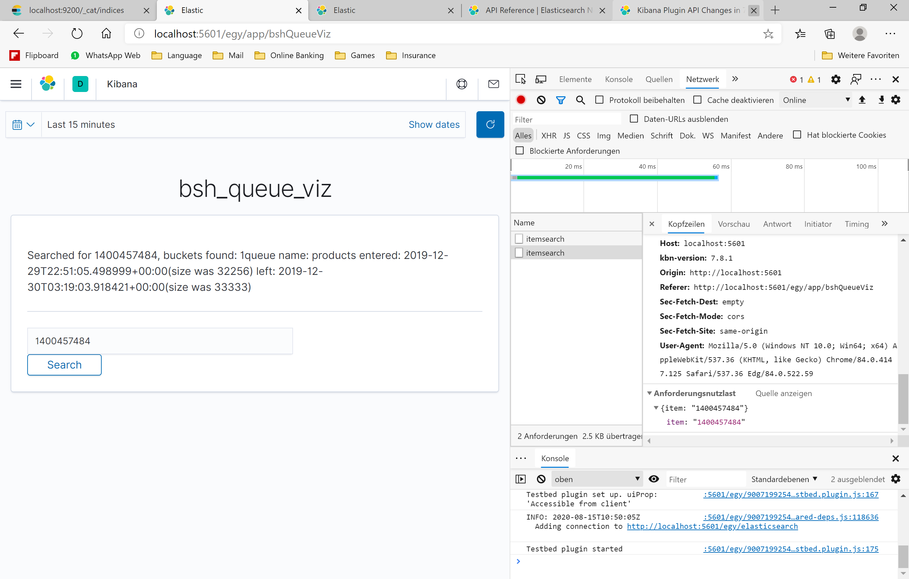

# Quick Install
## Setup Development Environment
download and install nvm from
https://github.com/coreybutler/nvm-windows/releases

```
cd C:\Development\
git clone https://github.com/elastic/kibana.git kibana
git checkout v7.8.1
cd C:\development\kibana\
nvm install 10.21.0 --reinstall-packages-from=10.16.3
nvm use 10.21.0
yarn policies set-version 1.22.4
yarn kbn bootstrap
node scripts/generate_plugin bsh_queue_viz
```
You might try to speedup Kibana a bit by editing C:\Development\kibana\config\kibana.yml
```
xpack.infra.enabled: false
xpack.logstash.enabled: false
xpack.canvas.enabled: false
```
## Start Elasticsearch
We currently use Elasticsearch version 7.8.1.
```
set ES_JAVA_OPTS="-Xms4g -Xmx4g"
cd c:\development\elasticsearch-7.8.1\bin
.\elasticsearch.bat
```

## Start Plug-In with Kibana
```
cd C:\development\kibana\plugins\bsh_queue_viz\
npm start
```
Now we can call http://localhost:5601/ in a browser.
Some queries one may start with are retrieving the schema by:
```
GET index_name/_mapping?pretty
```
and searching for the item "1400457484" entering and leaving a queue named "products":
```
POST /queues/_search
{
    "_source": ["timestamp", "name", "size"],
    "query": {
      "bool": {
        "must": [
          { "match": { "items": "1400457484" }},
          { "match": { "name": "products" }} 
        ]
      }
    },
    "aggs": {
      "queue_enter" : {
        "top_hits": {
          "size": 1,
          "sort": [ { "timestamp": { "order": "asc" } } ],
          "_source": { "includes": [ "timestamp", "name", "size" ] }
        }
      },
      "queue_left" : {
        "top_hits": {
          "size": 1,
          "sort": [ { "timestamp": { "order": "desc" } } ],
          "_source": { "includes": [ "timestamp", "name", "size" ] }
        }
      }
    },
    "size": 0
}
```
# Screenshot


# Architecture
tbd
