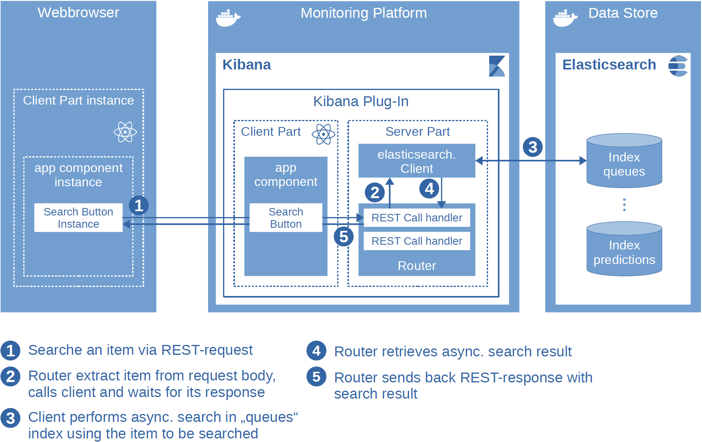
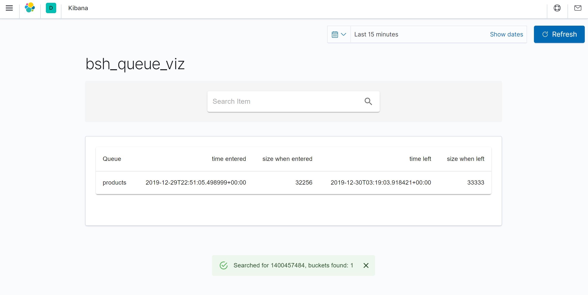

# Architecture
The folder structure is shown below:


The architecture consists of two main components -- Kibana and Elasticsearch, whereas the plug-in resides in Kibana and contains a server and a client part. Moreover the plug-in has an "app component". Note: when generating the plug-in skeleton, you may choose the (default) option **Yes** for both questions:
- Should an app component be generated? This allows you to not be limited on standard components and implement your own component
- Should a server API be generated? This generates you the server part of the plug-in.

The architecture is depicted below:



# Quick Install
## Setup Development Environment
download and install nvm from
https://github.com/coreybutler/nvm-windows/releases

```
cd C:\Development\
git clone https://github.com/elastic/kibana.git kibana
git checkout v7.10.2
cd C:\development\kibana\
nvm install 10.23.1 --reinstall-packages-from=10.16.3
nvm use 10.23.1
yarn policies set-version 1.22.4
yarn kbn bootstrap
node scripts/generate_plugin bsh_queue_viz

cd C:\Development\kibana\plugins\bsh_queue_viz\
yarn add @material-ui/core
yarn add @material-ui/lab
yarn add @material-ui/icons --network-timeout 100000
```
Optionally you may link the plugin folder "bsh_queue_viz" into another Kibana runtime, for example into the runtime located in the "kibana-7.10.2" folder:
```
new-item -itemtype symboliclink -path C:\Development\kibana-7.8.1\plugins\ -name bsh_queue_viz -value C:\Development\kibana\plugins\bsh_queue_viz
```
You might try to speedup Kibana a bit by editing C:\Development\kibana\config\kibana.yml
```
xpack.infra.enabled: false
xpack.logstash.enabled: false
xpack.canvas.enabled: false
```
## Start Elasticsearch
We currently use Elasticsearch version 7.10.2.
```
set ES_JAVA_OPTS="-Xms4g -Xmx4g"
cd c:\development\elasticsearch-7.10.2\bin
.\elasticsearch.bat
```
Does Elasticsearch run properly? Just check it by opening http://localhost:9200/_cat/indices in a browser.
## Import some data
We download and install elasticdump:
```
cd c:\development\elasticdump
npm install elasticdump
```
As an example we use the queue sample data "20200101-queues-sample.json.gz", which we extract to "c:\development\elasticdump".
We finally perform the import by
```
.\node_modules\.bin\elasticdump --output=http://localhost:9200/queues --input=./20200101-queues-sample.json --type=data
```
## Start Plug-In with Kibana
```
cd C:\development\kibana\plugins\bsh_queue_viz\
npm start
```
Now we can call http://localhost:5601/ in a browser.
Let us start with some queries. You may retrieve the schema by:
```
GET index_name/_mapping?pretty
```
And you may search for the item "1400457484" entering and leaving a queue named "products" by the following query:
```
POST /queues/_search
{
    "_source": ["timestamp", "name", "size"],
    "query": {
      "bool": {
        "must": [
          { "match": { "items": "1400457484" }},
          { "match": { "name": "products" }} 
        ]
      }
    },
    "aggs": {
      "queue_enter" : {
        "top_hits": {
          "size": 1,
          "sort": [ { "timestamp": { "order": "asc" } } ],
          "_source": { "includes": [ "timestamp", "name", "size" ] }
        }
      },
      "queue_left" : {
        "top_hits": {
          "size": 1,
          "sort": [ { "timestamp": { "order": "desc" } } ],
          "_source": { "includes": [ "timestamp", "name", "size" ] }
        }
      }
    },
    "size": 0
}
```
# Screenshot

