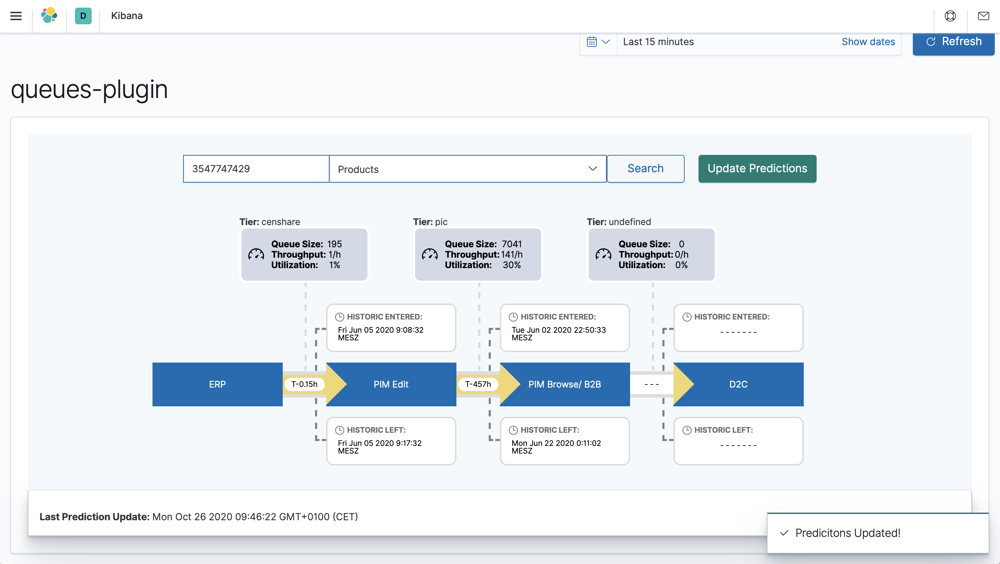
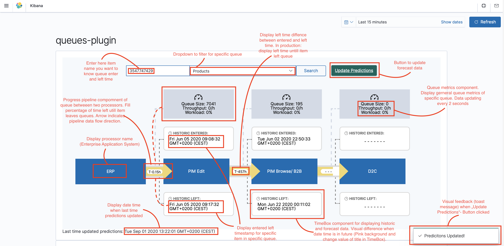
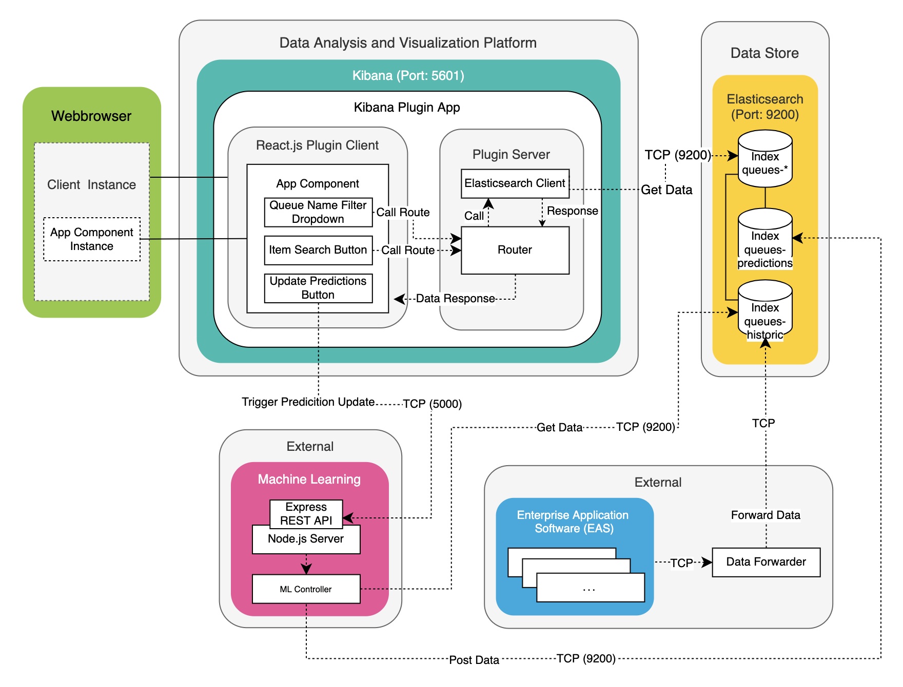
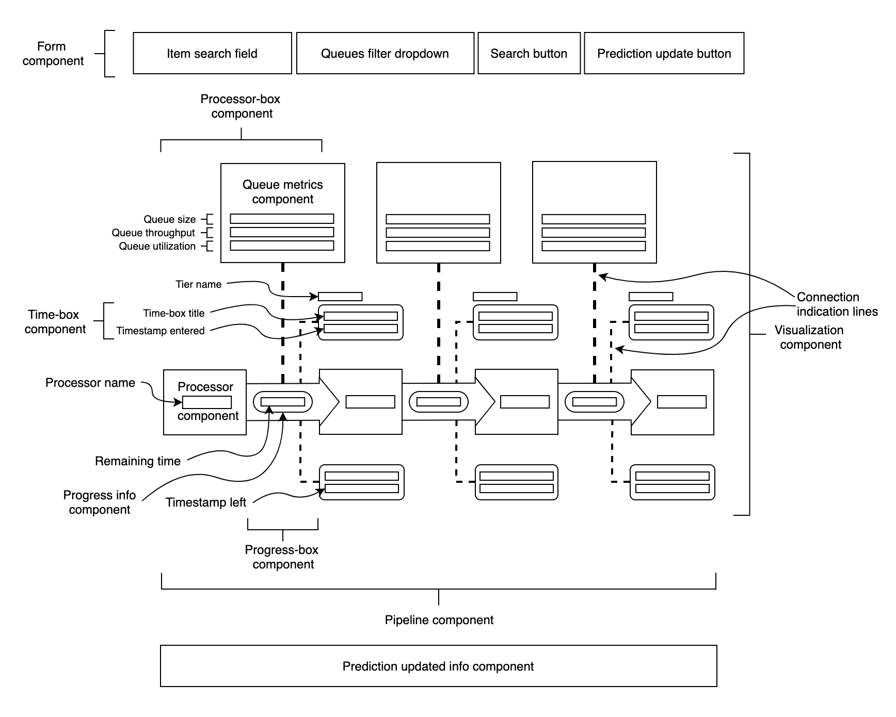
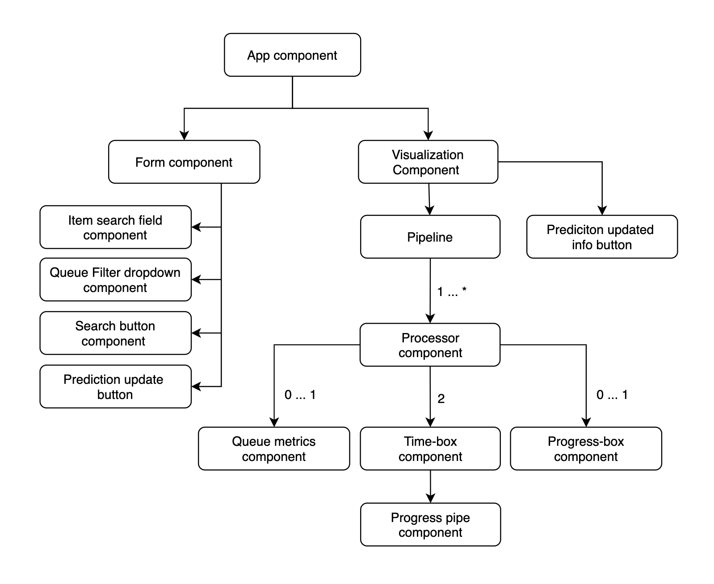

# Kibana Plugin App "Queues Plugin"

### Kibana Plugin App Demo



### Kibana Plugin App Demo with description



### Plugin Software Architecture

In the following we would like to present an architecture for the integration of the visualization solution via the approach as Kibana Plugin App. At the beginning a short overview of the functionality of the system will be given. First of all, the plugin architecture and the data flow within the system within the Kibana platform and with external systems involved will be presented.

First, a basic plugin framework was generated with the Javascript Runtime Node.js as follows: ```node /scripts/generate_plugin.js```. This program is provided by the Kibana development environment. Below you can find the automatically generated plugin in the ```/Plugins``` directory in the Kibana project directory. The client code is in the /public directory and the backend in ```/server```. The generation of the plugin can be rated as easy. The following dependencies should be considered when developing a Kibana Plugin App. The plugin development requires technological dependencies. Besides the Javascript Runtime Node.js, a frontend technology is required for the development of the UI, because Kibana Apps are implemented as SPA. For the UI development the Javascript library React.js is supported.

We have already implemented the frontend as React application before. Therefore the system now only needed to be integrated into the Kibana platform. React components could be adopted so that they can be displayed in the Kibana app. The components: search box, drop down and buttons have been replaced by the corresponding [Elastic UI](https://elastic.github.io/eui/#/) component. Elastic UI is a design library used by Elastic to implement internal products. They correspond to the specifications of Elastic. EUI can also be used in the development of Kibana plugins. To aesthetically match the plugin to the Kibana platform, EUI was used in the plugin.



The queries are stored in the ```routes``` directory of a Kibana plugin and defined in ```index.ts```. 

```Typescript
const { Client } = require(’@elastic/elasticsearch’)
const client = new Client({ node: ’http://localhost:9200’)

// promise API
const result = await client.search({
    index: ’my-index’, 
    body: {
        query: {
            match: { hello: ’world’ }
        }   
    }
})
// callback API 
client.search({
    index: ’my-index’, 
        body: {
            query: {
                match: { hello: ’world’ }
            } 
        }
}, (err, result) => {
    if (err) console.log(err)
})
```

Here we see a route example for data query to the desired Elasticsearch Index. The route is called from the frontend via a HTTP request:

```Typescript
router.post({
    path: ’/api/item’, 
    validate: {
        body: schema.object({ item: schema.string(), name: schema.string(), tier: schema.string()}), 
    }
},
async (context, request, response) => {
const data = await client.search({ 
    index: ’queues’,
    body: {
        "_source": ["timestamp", "name", "size", "tier"], 
        "query": {
            "bool": {
                "must": [
                    { "match": { "items": request.body.item }},
                    { "match": { "tier": request.body.tier }},
                    { "match": { "name": request.body.name }} 
                ]
            } 
        },
        "aggs": { 
            "queue_enter" : {
                "top_hits": {
                    "size": 1,
                    "sort": [ { "timestamp": { "order": "asc" } } ],
                    "_source": { "includes": [ "timestamp", "name", "size", "tier" ] }
                }
            }, 
            "queue_left" : { 
                "top_hits": { 
                    "size": 1,
                    "sort": [ { "timestamp": { "order": "desc" } } ],
                    "_source": { "includes": [ "timestamp", "name", "size", "tier" ] }
                } 
            }
        } 
    },
    "size": 0 
    });
    return response.ok({ body: { data: data }, }); });
```

A POST request with query parameters sent to the router in the plugin server. The router sends a request to the internal Elasticsearch API, which communicates with Elasticsearch. 

A realization of the update function of forecast data was sent in this integration approach via a request request to an API server. This triggers the start of a Python application, which updates the predictions by machine learning and sends them to the target database. Machine learning models and ML management are not part of this thesis. Only infrastructural approaches in the context of ML processes were tested via the presented Proof of Concept (POC). 

The Kibana plugin has the highest degree of flexibility in implementing features. Especially noteworthy is the support of the powerful query DSL, which allows us to define very complex data queries that can be processed by the plugin. Furthermore, in contrast to preliminary integration iteration, we were able to use interactive GUI elements such as buttons, search fields, drop-down filtering, etc. in the plugin. 

However, the Kibana plugin integration approach should also be viewed critically. Due to the high degree of implementation complexity, the development of custom software according to customer needs can have a significantly higher additional development and customization effort than for institutions. When integrating into host infrastructures, it is important to consider how much modification of the standard program codes is acceptable, so that updateability is still guaranteed.  
In addition, when using the Kibana plugin, it must be noted that the Kibana plugin interfaces are in constant development. Due to the high rate of change, no guarantee can be given for backwards compatibility of Kibana. Kibana forces the installed plugins to be compatible with the voice. Plugin developers must therefore release a new version of their plugin for each new Kibana release.

### Plugin Components
During the design phase, we take into consideration the future infrastructure of BSH, because the system will be operated in this environment later on. As a result, it provides guidelines for technology decisions for the application to be developed. The application consists of a front-end, which forms the graphical user interface; and data maintenance. The data preservation was implemented with Elasticsearch. In this system, Elasticsearch plays a central role because it serves as a database for the PIA data at BSH and as a data source for the software system to be developed. It is a search and analysis engine. Elasticsearch is based on Apache Lucene6 technology. This technology is fundamentally different from traditional relational databases. It provides storage, search and analysis functions. The full text search of Elasticsearch allows searching all terms available in the database. In addition, Elasticsearch has a very comprehensive REST API that works with the Hypertext Transfer Protocol (HTTP). The REST-API is very well documented and quite comprehensive and makes all functions available via HTTP. Thus Elasticsearch can be integrated very easily into any application with REST interface. Elasticsearch is horizontally scalable and offers data queries in almost real time. Elasticsearch allows you to index thousands to hundreds of thousands of documents per second and makes them available for search almost immediately.
The frontend processes what is displayed in the graphical user interface (GUI) in a web browser. The implementation work was based on the design of the GUI. In the following you can see the final mockup of the graphical structuring of the system as a result of the graphical design process. The visualization is designed in a process map abstraction. A process map visually indicates the steps of a work activity that are involved in the execution of the individual steps. This is intended to provide an accurate and quick overview of the PIA status of a product and information on metrics of the respective queues between the application systems in the process chain.



The frontend consists of a number of React components. React is a JavaScript library for creating user interfaces. It enables a simple development of state-controlled applications. React runs on the client side. A React application can contain several components that can be used multiple times. With React single page applications (SPA) can be developed. Compared to conventional web applications, SPAs are more powerful.
All React components were developed from scratch for this project. The React components implemented for this application can be seen in the following figure. 



The overview shows the structure of the essential components within the application. The entities in this figure represent the different GUI components in the monitoring solution. The arrows indicate which components are defined by others, e.g. the form component and the visualization component is defined by the app component. Parts of the form component are a search field, dropdown element, search button and the forecast update button. The visualization component defines the processor pipeline and the information component for displaying the last forecast update. The pipeline component defines an arbitrary number of processors, each with one or no metric component, at least two time display components and one or no progress component. The progress component defines one progress bar component each. Typescript was also used in the development of the prototype system. Typescript is a kind of wrapper around JavaScript or an extension of it. Any valid JavaScript code also valid TypeScript code. However, TypeScript adds things beyond JavaScript, the most important being the data types, as the name implies. With JavaScript and its loosely typed nature, errors are easy to make, e.g. passing a string where a numeric value is expected. With TypeScript, such errors are quickly and easily detected by various tools. With CSS, the HTML elements in the implemented React components were described in terms of design.
To map the PIA queue data, the application was tested using test data that could be accessed locally via a Test-Elasticsearch-index. The Elasticsearch API was used to implement data queries to Elasticsearch. When using the Elasticsearch API, a JSON object with the Elasticsearch specific query language DSL query is sent to the Elasticsearch client, which responds with the desired data from the Elasticsearch index, also in JSON format. Query DSL is a JSON-based language for defining queries.

#### How to Contribute?

### Kibana Plugin Development Environment and Starting Kibana Plugin App

- Download Kibana Source Code from Elastic Website
  - [Github - Kibana Releases](https://github.com/elastic/kibana/releases)
- 1. go to kibana directory
  - Important has to be named as "kibana"
- ```git init```
- Install missing module 
  ```
  yarn add fsevents
  yarn add fork-victorvhn-react-loading-overlay
  ```
- Change node version with nvm:
  ```nvm use```
  - when not requested version installed install via nvm
    ```nvm install X.X.X```
- 2. install bootstrap kibana via yarn
  -> yarn installed? -> Yarn package manager require, Does not work with npm without side effects
  ```
  yarn kbn bootstrap
  ```
- 3. start kibana
  ```
  yarn start --oss
  ````
  - basepath proxy server running at http://localhost:5601/XXX


### Start Custom Kibana Plugin 'queues_plugin_full_integrated'
- 1. Add Kibana Plugin ``dc_cubes/plugins/kibana-plugin/queues_plugin_full_integrated/`` to directory ``/kibana/plugins/`` in your Kibana Development Environment
- 2. ``yarn start --oss``

---

## Kibana Development Documentation

See the [kibana contributing guide](https://github.com/elastic/kibana/blob/master/CONTRIBUTING.md) for additional instructions setting up your development environment.
