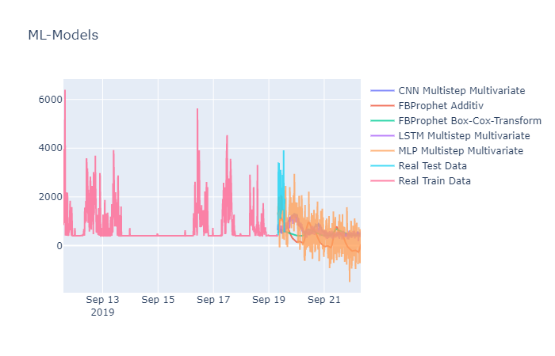
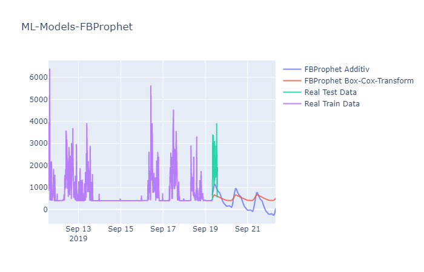
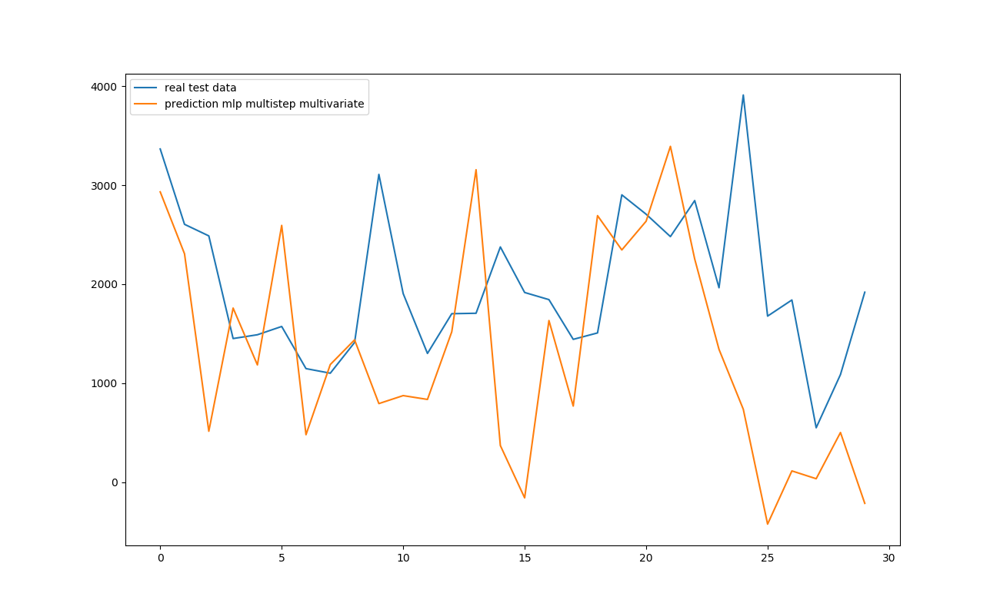
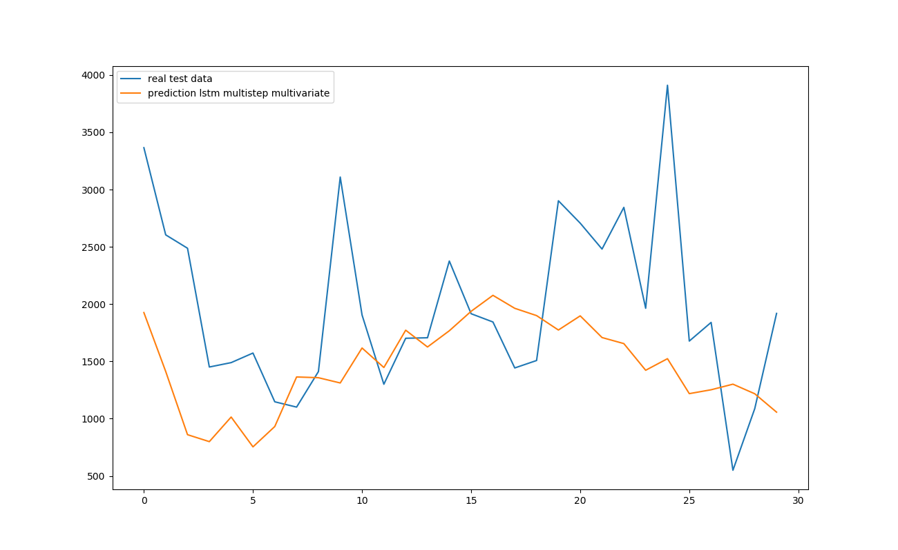
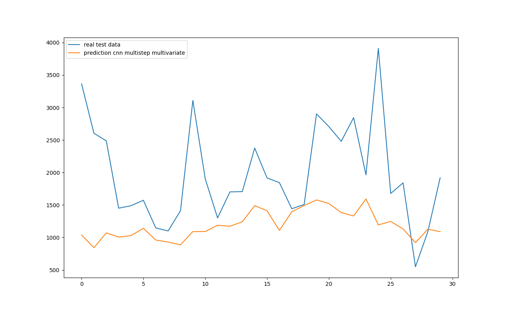
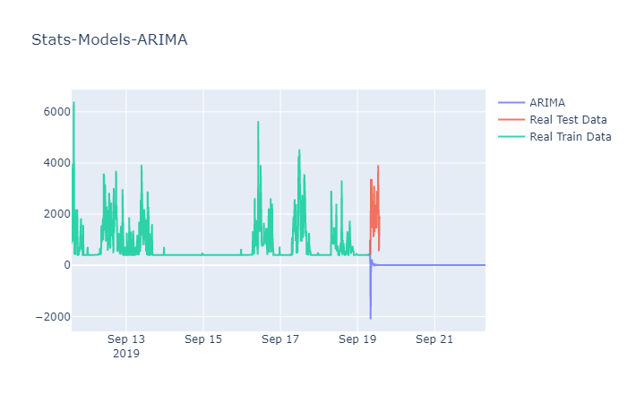

# Research

## Scientific Work
In the following you will find a list of the scientific work, produced within the DC Cube project:
- [Paper: Visualization and Machine Learning for Data Center Management](https://dl.gi.de/handle/20.500.12116/25052)
- [Thesis: Nicolas Walk](docs/bachelorthesis_walk_nicolas.pdf)

## Proving Machine Learning Models

Crucial to the outlook for expectable infrastructure data, four different approaches have been tested so far:
- [FBProphet](#fbprophet)
- [Multilayer Perceptron](#multilayer-perceptron)
- [Long Short-Term Memory](#long-short-term-memory)
- [Convolutional Neural Network](#convolutional-neural-network)

In the following chart, all forecasts of the respective models are visualized with the specific parameter set:

| Parameter  | Value |
| ------------- | ------------- |
| prediction horizon  | 432 (3 days)  |
| n history  | 36 (6 hours)  |

 
The individual results are considered in detail below and also available as [plotly html view](docs/plotly.zip).

### FBProphet
The Python framework FBProphet was used for prototyping with the following parameters:
| Parameter  | Value |
| ------------- | ------------- |
| changepoints  | default  |
| seasonality_mode  | additive  |
 
 Further information: [FBProphet](https://facebook.github.io/prophet/), [Prophet: forecasting at scale](https://research.fb.com/blog/2017/02/prophet-forecasting-at-scale/)

### Multilayer Perceptron
The Python frameworks Keras/Scikit-Learn were used for prototyping with the following parameters:
| Parameter  | Value |
| ------------- | ------------- |
| activation  | relu  |
| solver/optimizer  | adam  |
| loss  | mse  |
| metrics  | accuracy  |
 
Further information: [Multilayer Perceptron](https://en.wikipedia.org/wiki/Multilayer_perceptron), [Keras](https://keras.io/)

### Long Short-Term Memory
The Python frameworks Keras/Scikit-Learn were used for prototyping with the following parameters:
| Parameter  | Value |
| ------------- | ------------- |
| activation  | relu  |
| solver/optimizer  | adam  |
| loss  | mse  |
| metrics  | accuracy  |
 
Further information: [Long Short-Term Memory](https://en.wikipedia.org/wiki/Long_short-term_memory), [Keras](https://keras.io/)

### Convolutional Neural Network
The Python frameworks Keras/Scikit-Learn were used for prototyping with the following parameters:
| Parameter  | Value |
| ------------- | ------------- |
| activation  | relu  |
| solver/optimizer  | adam  |
| loss  | mse  |
| metrics  | accuracy  |
 
Further information: [Convolutional Neural Network](https://en.wikipedia.org/wiki/Convolutional_neural_network), [Keras](https://keras.io/)

## Proving Stats Models

### AutoRegressive Integrated Moving Average
The Python frameworks Statsmodels/Scikit-Learn were used for prototyping. 
 
Further information: [AutoRegressive Integrated Moving Average](https://en.wikipedia.org/wiki/Autoregressive_integrated_moving_average), [Statsmodels](https://www.statsmodels.org/stable/tsa.html)