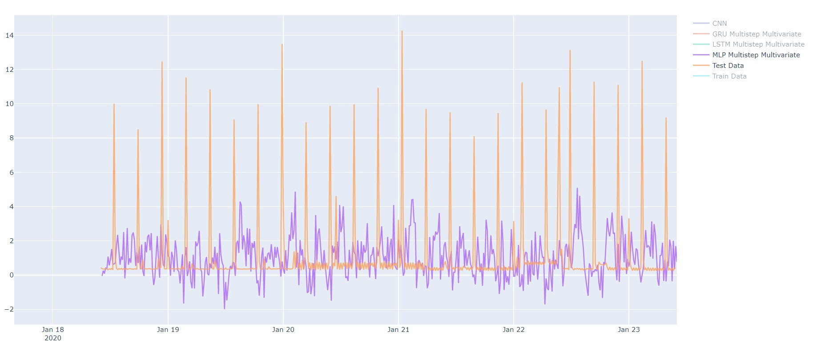
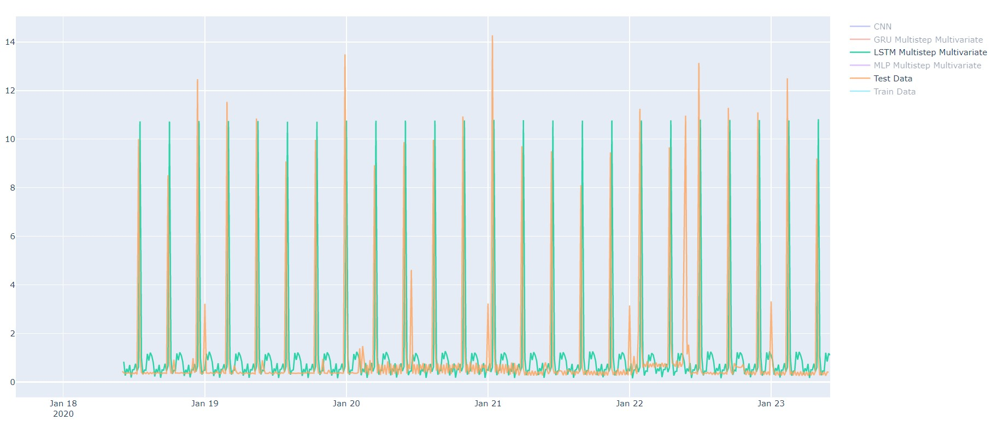
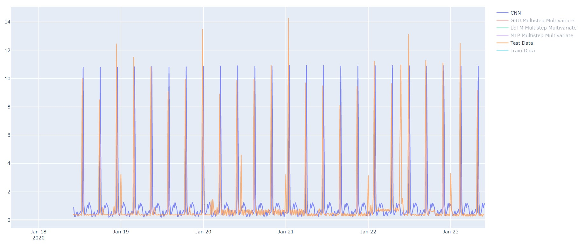
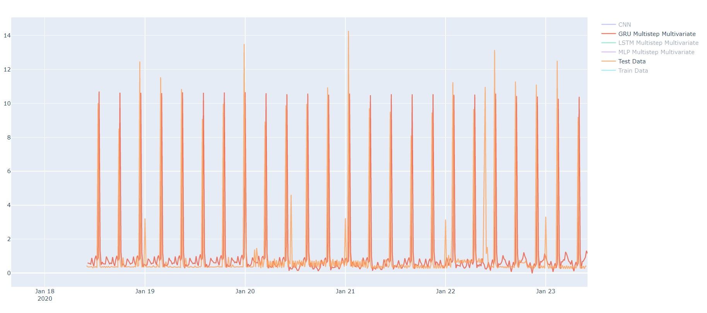

# Research

## Scientific Papers
In the following you will find a list of the scientific work, produced within the DC Cube project:
- [Paper: Visualization and Machine Learning for Data Center Management](https://dl.gi.de/handle/20.500.12116/25052)

## Theses
- [Thesis: Konzeption eines Systems zur 3D-Visualisierung der Auslastung von Rechenzentren](docs/theses/LukasSprinck_Masterarbeit.pdf)
- [Thesis: Architekturerstellung und Implementierung eines Systems zur Visualisierung und Analyse von Auslastungszeitreihen](docs/theses/bachelorthesis_walk_nicolas.pdf)
- [Thesis: Aufbau einer Integrationsarchitektur für ein Auslastungsanalysetool in Grafana](docs/theses/bachelorarbeit_odorfer.pdf)
- [Thesis: Integration von Python-basierten Vorhersagemodellen in ein Monitoring-Webdashboard](docs/theses/Bachelorarbeit_Steindl_Sebastian.pdf)
- [Thesis: Machine Learning für Zeitreihen – Modell zur Vorhersage von Serverauslastungen](docs/theses/bachelorarbeit_ivan_levarda.pdf)
- [Thesis: Aufbau einer Integrationsarchitektur für ein Auslastungsanalysetool in Kibana](docs/theses/bachelorarbeit_burak_kayaalp.pdf)

## Talks
- [Architecture Gathering](https://www.the-architecture-gathering.de/), 17. Oct 2019, _Eine Data Science-Architektur für die Analyse und Visualisierung von Rechenzentrumsdaten der Bundesagentur für Arbeit_ ([slides, german](docs/Do12-Sultanow-Sessler.pdf))
- [OOP software meets business](https://www.oop-konferenz.de/), 04. Feb 2020, _Visualize And Predict Product Information Processing at BSH In Real Time_ ([slides](docs/oop2020_BSH_predict_product_information_processing.pdf))

## Proving Machine Learning Models
The following methods rely on a dataset that was derived from one server of a large IT-infrastructure. We focus our prediction on the metric that measures the usage of the CPU. Where possible, we use the dataset as a multivariate input (LSTM, MLP, CNN), otherwise the input consists solely of the measures of the usage of CPU.  

Crucial to the outlook for expectable infrastructure data, four different approaches have been tested so far:
- [FBProphet](#fbprophet)
- [Multilayer Perceptron](#multilayer-perceptron)
- [Long Short-Term Memory](#long-short-term-memory)
- [Convolutional Neural Network](#convolutional-neural-network)
- [Gated Recurrent Unit](#gated-recurrent-unit)
- [SARIMA](#seasonal-autoregressive-integrated-moving-average-sarima)

In the following chart, all forecasts of the respective models are visualized with the specific parameter set:

| Parameter  | Value |
| ------------- | ------------- |
| prediction_horizon  | 480 (5 days)  |
| n_history  | 32 (8 hours)  |

 
The individual results are considered in detail below and also available as [plotly html view](docs/plotly.zip).
The measures of training runtime are based on: i5 CPU, 8Gb RAM, no GPU support
### FBProphet
The Python framework FBProphet was used for prototyping with the following parameters:

| Parameter  | Value |
| ------------- | ------------- |
| changepoints  | default  |
| seasonality_mode  | additive  |
| weekly_seasonality  | True  |
| training runtime | 7-10 seconds|

 
 Further information: [FBProphet](https://facebook.github.io/prophet/), [Prophet: forecasting at scale](https://research.fb.com/blog/2017/02/prophet-forecasting-at-scale/)

### Multilayer Perceptron
The Python frameworks Keras/Scikit-Learn were used for prototyping with the following parameters:

| Parameter  | Value |
| ------------- | ------------- |
| activation  | tanh  |
| solver/optimizer  | adam  |
| loss  | mse  |
| Hidden Layer | 2 |
| training runtime | 5m (EarlyStop after 50 epochs based on val_loss)|
| epoch time with PCA | 25s|
| epoch time without PCA | 150s|
| best val_loss (MSE) with PCA| 0.976|
| best val_loss (MSE) without PCA| 1.090|
| RMSE (with test data) | 2.670|

 
Further information: [Multilayer Perceptron](https://en.wikipedia.org/wiki/Multilayer_perceptron), [Keras](https://keras.io/)

### Long Short-Term Memory
The Python frameworks Keras/Scikit-Learn were used for prototyping with the following parameters:

| Parameter  | Value |
| ------------- | ------------- |
| activation  | tanh  |
| solver/optimizer  | adam  |
| loss  | mse  |
| Hidden Layer | 2 (each with 75 LSTM cells) |
| training runtime | 2m40s (EarlyStop after 50 epochs based on val_loss)|
| epoch time with PCA | 6s |
| epoch time without PCA |6s |
| best val_loss (MSE) with PCA| 0.4613|
| best val_loss (MSE) without PCA| 0.4528 |
| RMSE (with test data) | 1.435 |

 
Further information: [Long Short-Term Memory](https://en.wikipedia.org/wiki/Long_short-term_memory), [Keras](https://keras.io/)

### Convolutional Neural Network
CNNs which originated from the area of image processing can also be used to predict time series. 
The Python frameworks Keras/Scikit-Learn were used for prototyping with the following parameters:

| Parameter  | Value |
| ------------- | ------------- |
| activation  | tanh  |
| solver/optimizer  | adam  |
| loss  | mse  |
| layer| Conv1d, MaxPooling, Conv1d, MaxPooling, 2xLSTM, Dense |
| training runtime | 1m50s (EarlyStop after 134 epochs based on val_loss) |
| epoch time with PCA | 1s|
| epoch time without PCA  | 1s |
| best val_loss (MSE) with PCA| 0.425|
| best val_loss (MSE) without PCA| 0.433|
| RMSE (with test data) | 1.00 |

 
Further information: [Convolutional Neural Network](https://en.wikipedia.org/wiki/Convolutional_neural_network), [Keras](https://keras.io/)

### Gated Recurrent Unit
Gated Recurrent Units are similiar to LSTM-Cells, but less complex. It can't be determined, which of those two generally performs better without evaluating it for the specific tasks, see: Junyoung Chung et al. „Empirical Evaluation of Gated Recurrent Neural Networks on Sequence Modeling“.
The Python frameworks Keras/Scikit-Learn were used for prototyping with the following parameters:

| Parameter  | Value |
| ------------- | ------------- |
| activation  | tanh  |
| solver/optimizer  | adam  |
| loss  | mse  |
| Hidden Layer | 2 (each with 75 GRU cells) |
| training runtime | 4m (EarlyStop after 58 epochs based on val_loss)|
| epoch time with PCA | 8s |
| epoch time without PCA | 7s|
| best val_loss (MSE) with PCA| 0.500 |
| best val_loss (MSE) without PCA| 0.446|
| RMSE (with test data) | 1.189|

 
Further information: [Gated Recurrent Unit](https://en.wikipedia.org/wiki/Gated_recurrent_unit), [Keras](https://keras.io/)

### Comparison of all forecasts

## Proving Stats Models

### Seasonal AutoRegressive Integrated Moving Average SARIMA
We used a SARIMA-Model with the parameters (1, 3, 0)(1, 1, 1, n_history) where n_history ist the timesteps in the past considered for the other models
The Python frameworks Statsmodels/Scikit-Learn were used for prototyping. 
 
Further information: [AutoRegressive Integrated Moving Average](https://en.wikipedia.org/wiki/Autoregressive_integrated_moving_average), [Statsmodels](https://www.statsmodels.org/stable/tsa.html)

## Why LSTM, GRU and CNN are suited for time series
When working with a time series its important to keep in mind that there is a correlation between the timestamps, e.g. between the value at timestep t and t-1. A standard MLP does not use this information. Reccurrent Neural Networks have an internal memory or state to account for that, making them suited for sequences (Timeseries, Translation, NLP). However, with the recurrent connection comes a problem: vanishing/exploding gradients. This basically means that the gradient gets too small/big and the NN can't learn the dependencies well anymore. LSTMs were designed to tackle this problem. They are a special architecture for the layers in a RNN. They use the so called constant error carousel (CEC) to represent the internal state and multiple gates to control or protect it. GRUs are similiar to LSTM-Units and ultimatley based on them, but are less complex in their structure. They still have an internal state and two gates to control it.   

The CNN on the other hand might seem surprinsig at first. They are commonly used when working with images, e.g. classification. For this, the image is interpreted as a 2d grid. When using a CNN for timeseries however, you interpret your data as a 1d grid. The frequency between the measures determines the grid. The rest of the process is the same as when working with images. The CNN therefore will likely learn shorter term dependencies. 
In this project we used a LSTM-Layer within the CNN, harnessing the advantages of both methods.  

## Optimization
PCA (Principal Component Analysis): PCA (https://en.wikipedia.org/wiki/Principal_component_analysis) can be used to reduce the dimension/features of our data while retaining most of the information (e.g. > 95%) by representing redundant information in a lesser dimension. Therefore it can lessen the effect of the so called "curse of dimensionality" (https://en.wikipedia.org/wiki/Curse_of_dimensionality) and speed up the training of the ANN. PCA itself can be considered as an unsupervised machine learning algorithm. With our specific dataset, we were able to reduce the number of features from about 180 to 60 while keeping 95% of the variance. Concering runtime, it only had a noticable effect on the MLP where the time per epoch could be reduced to about 1/5 compared to the training without PCA. The performance/accuracy of the Nets wasn't greatly affected - as expected. With PCA we noticed a small improvement in validation loss for the MLP and CNN while experiencing a small negative on validation loss for the LSTM- and GRU-Net.

Early Stopping: Early Stopping is an easy and effective regularization method. In every epoch the validation loss is monitored and if it improves, the model is saved. If no model improvement happened for a certain number of epochs, the training is stopped. This way, no matter if the training is stopped early or if all epochs are being run, in the end the best model will be obtained. This is useful, since the validaion loss usually starts increasing ("U" curve) again while the training loss is still being reduced. Therefore, Early Stopping helps us to avoid overfitting while and might conveniently even reduce training time. 
